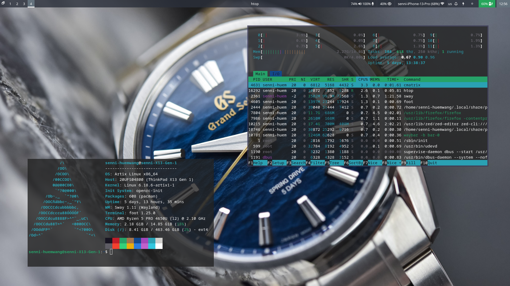
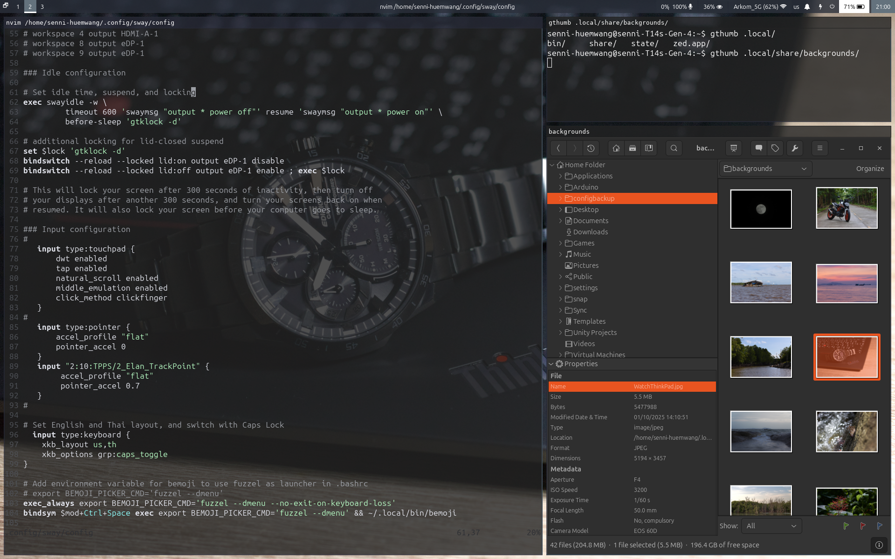
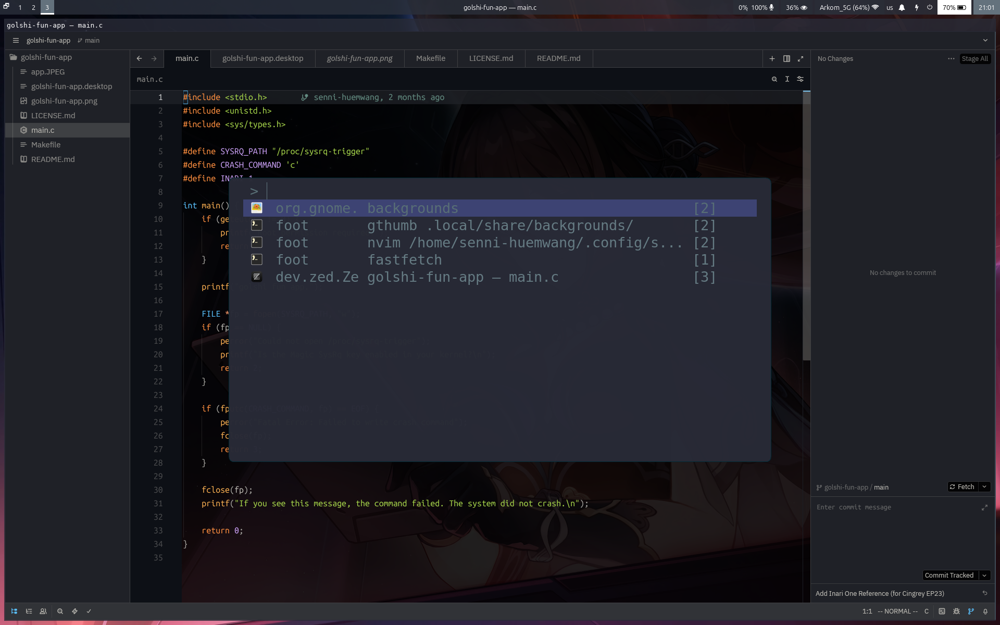

# Senni's minimal dotfiles for swaywm, zed, neovim, cava, and fastfetch

(Looking for wallpapers for your new rice? [Check my wallpapers out!](https://github.com/senni-huemwang/backgrounds/))

## Instructions

## IMPORTANT : For systemd-based systems, comment line 22, 27-29

Put all the directories under $HOME/.config/, and install required packages.

- cava
- fastfetch
- neovim
- vim-plug
- foot
- sway
- autotiling
- fonts-awesome
- swaybg
- waybar
- brightnessctl-utils
- fuzzel
- swayidle
- gtklock
- grim
- slurp
- grimshot
- playerctl
- bemoji (This config assumes bemoji is stored in ~/.local/bin/)
- swayr (This config assumes you install swayr with cargo, and the binary is stored in ~/.cargo/bin. Change the path in line 87-88 in sway/config)
- sway-notification-center

In order for brightness controls to function properly, you must add yourself into "video" and "input" group.

`sudo usermod -a -G video,input USER`

In order to use the custom fastfetch config, run `fastfetch` with an option to a custom config file. (In this dotfiles, a minimal custom file showing Tsukasa Tenma as logo is included)

`fastfetch -c /path/to/config/file/tsukasa.jsonc`

## Keyboard Shortcuts

- Default Mod key is Super/Windows key
- Keyboard layout is set as US and TH, and switch layout with Caps Lock (change this in line 76-79 in ./sway/config)
- You can use either arrow keys or H/J/K/L

| Keybind                                       | Function                                                                                     |
|-----------------------------------------------|----------------------------------------------------------------------------------------------|
| Super + Enter                                 | Open terminal (foot)                                                                         |
| Super + Backspace                             | Kill window                                                                                  |
| Super + D                                     | Launch Application Launcher (fuzzel)                                                         |
| Super + Shift + E                             | Exit sway session  (Alternatively, you can run `swaymsg exit` to skip confirmation dialogue.)|
| Super + H/J/K/L                               | Move focus between windows                                                                   |
| Super + Shift + H/J/K/L                       | Move windows in workspace                                                                    |
| Super + [Number]                              | Switch workspaces                                                                            |
| Super + Shift + [Number]                      | Move focused window to workspaces                                                            |
| Three finger swipe left/right (Touchpad only) | Alternative for 'switch workspaces'                                                          |
| Super + PgUp/PgDn                             | Alternative for 'switch workspaces'                                                          |
| Super + V                                     | Toggle floating window                                                                       |
| Super + R                                     | Enter resize mode,  use arrow keys or H/J/K/L to resize window Exit with Enter or ESC        |
| Super + Shift + -                             | Save focused window in scratchpad                                                            |
| Super + -                                     | Show window that was saved in scratchpad                                                     |
| Super + Print                                 | Take screenshot of entire screen (grim & grimshot)                                           |
| Super + Shift + Print                         | Select and take screenshot of a window                                                       |
| Super + Ctrl + Space                          | Open Emoji selector (bemoji)                                                                 |
| Super + \ (Backslash)                         | Open all running windows selector (swayr)                                                    |
| Super + N                                     | Open Notification Center (swaync)                                                            |
